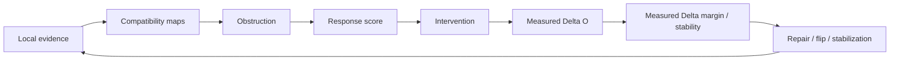
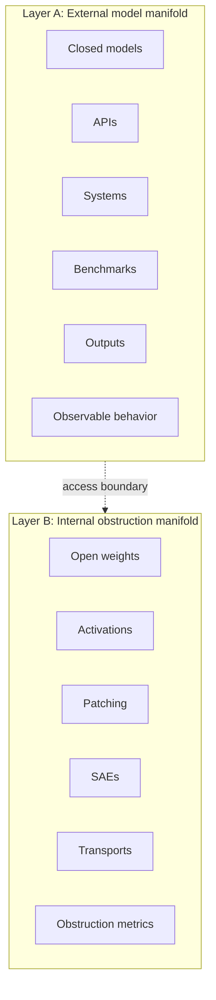
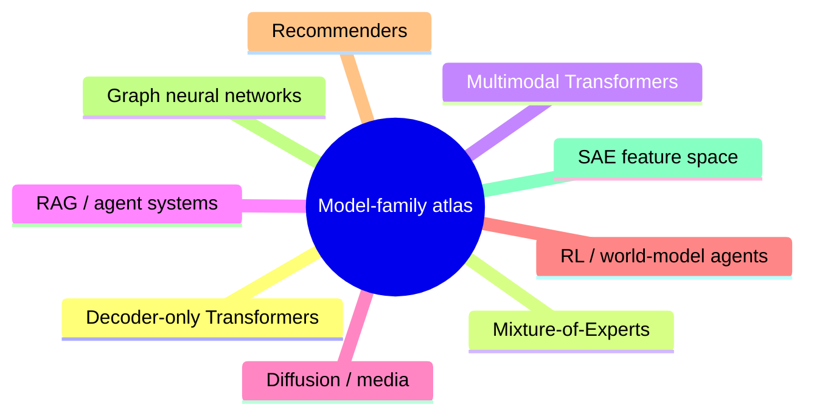
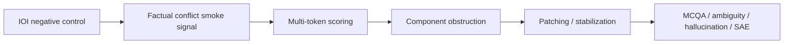

# Math Map V0 Mermaid Diagrams

## 1. Obstruction-Response Loop

```mermaid
flowchart LR
    A[Local evidence] --> B[Compatibility maps]
    B --> C[Obstruction]
    C --> D[Response score]
    D --> E[Intervention]
    E --> F[Measured Delta O]
    F --> G[Measured Delta margin / stability]
    G --> H[Repair / flip / stabilization]
    H --> A
```

## 2. Two-Layer Atlas

```mermaid
flowchart TB
    subgraph External[Layer A: External model manifold]
        E1[Closed models]
        E2[APIs]
        E3[Systems]
        E4[Benchmarks]
        E5[Outputs]
        E6[Observable behavior]
    end

    subgraph Internal[Layer B: Internal obstruction manifold]
        I1[Open weights]
        I2[Activations]
        I3[Patching]
        I4[SAEs]
        I5[Transports]
        I6[Obstruction metrics]
    end

    External -. access boundary .-> Internal
```

## 3. Model-Family Atlas

```mermaid
mindmap
  root((Model-family atlas))
    Decoder-only Transformers
    Mixture-of-Experts
    Multimodal Transformers
    RAG / agent systems
    Diffusion / media
    RL / world-model agents
    Recommenders
    Graph neural networks
    SAE feature space
```

## 4. Current Empirical Ladder

```mermaid
flowchart LR
    A[IOI negative control] --> B[Factual conflict smoke signal]
    B --> C[Multi-token scoring]
    C --> D[Component obstruction]
    D --> E[Patching / stabilization]
    E --> F[MCQA / ambiguity / hallucination / SAE]
```
